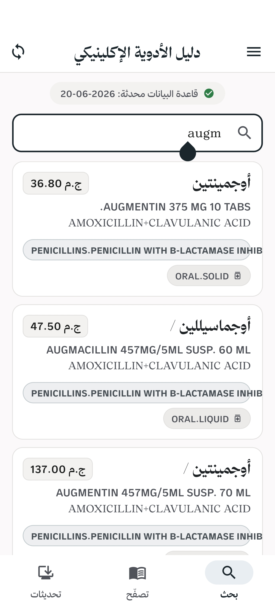
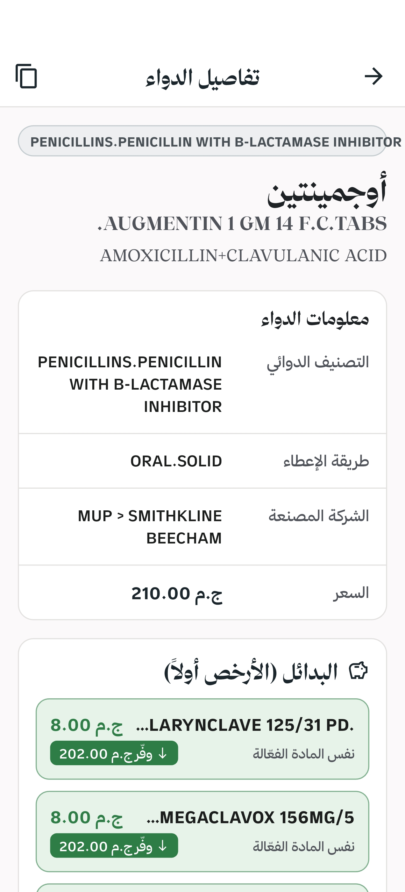
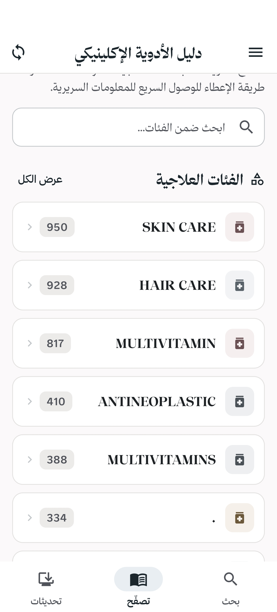
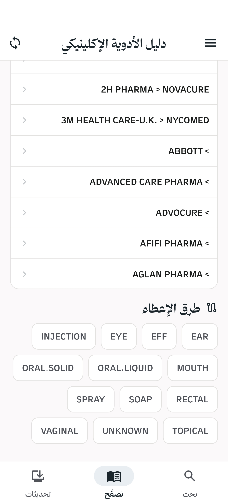
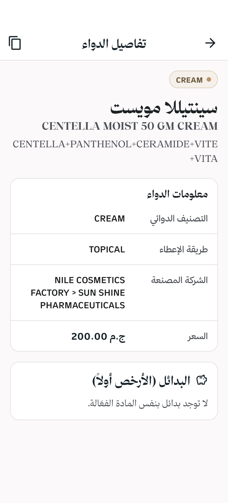
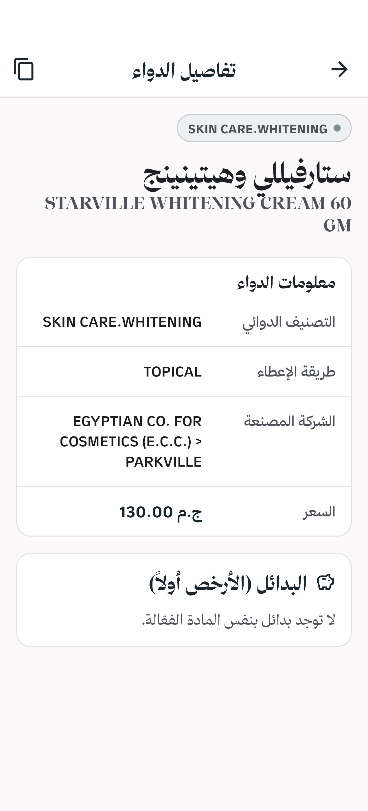

# Pharmacy Manual: APK downloads

An Arabic-first, offline Egyptian drug index, price checker, and **dose calculator** for Android.

## Download

- **[pharmacy-manual-v0.3.0.apk](https://github.com/karem505/pharmacy-manual-apk/raw/main/pharmacy-manual-v0.3.0.apk)** (about 62 MB) — current

To install: download the APK, enable "install from unknown sources" on your Android device, then open the file. Works on Android 5.0 and newer.

This build is **signed with a release key** (v1+v2+v3). If you already have an older build installed, **uninstall it first** — a differently-signed copy will not install over it.

### Verify your download (optional)

- **SHA-256 of the APK:** `9723f39c6645f7ecbc87a6fffaebd0d090098f0d06bf840001bed295e7117a7b`
  (`sha256sum pharmacy-manual-v0.3.0.apk`)
- **Signing certificate SHA-256:** `98a8ac45aa15f1c068ff8c7a6602592b0472be353bfb22158c43dd53f05b9403`
  (`apksigner verify --print-certs pharmacy-manual-v0.3.0.apk`)

_Previous build: `pharmacy-manual-v0.2.2.apk` (release-signed) is kept for rollback._

## Screenshots

  
  
  
  
  
  

▶ **[Watch the demo video](screenshots/demo.mp4)**

## What's new in 0.3.0

- **Interactive dose calculator on every drug page.** Enter a weight (and a syrup/injection concentration) to compute the daily dose, the per-dose amount, and the volume in millilitres. The result turns **red only when a dose truly exceeds the maximum**.
- **Verified reference doses** for 116 active ingredients — population-specific (adult / paediatric), each one cited to its source (WHO Model Formulary, BNF, FDA/DailyMed, UK SmPC) and independently checked. Around 23% of products now show a pre-filled dose; the rest use the calculator.
- **Clinical tools**: body surface area (Mosteller), creatinine clearance (Cockcroft–Gault), and IV infusion rate.
- Every dosing surface carries a **"verify before dispensing" disclaimer**. Dosing is guidance only — always confirm against an approved reference and a licensed pharmacist.

## What's new in 0.2.2

- The app is signed with a proper **release key** instead of the Android debug key — a stable, tamper-evident identity. All future updates install cleanly over this one.

## What's new in 0.2.1

- Fixes the "check for updates" button — release builds were missing the INTERNET permission, so the database update could not reach GitHub.

## What's new in 0.2.0

- A complete visual redesign — the "Clinical Field Guide" look: calm Ink-Blue brand, reserved red/amber/green safety colours, serif drug names with tabular-figure prices, and class-coded chips.
- New branded app icon and an Arabic app name (دليل الأدوية).
- Browse by therapeutic class, manufacturer, and route, each with live counts.
- A clearer drug-detail price checker that badges cheaper same-ingredient alternatives.

## What it does

- Bilingual, diacritic-insensitive search across 24,868+ medicines (Arabic alias, English name, active ingredient)
- **Dose calculator and verified reference dosing** on each drug page, plus BSA, creatinine clearance, and infusion-rate tools
- Drug detail with a cheapest same-ingredient price comparison (find a cheaper equivalent)
- Browse by drug class, manufacturer, and route
- Light and dark themes, Arabic-first RTL throughout
- An embedded database that updates itself when the source data changes

## Data and disclaimer

Drug data is released under CC0 from [egyptian-drug-database](https://github.com/karem505/egyptian-drug-database). Dosing is compiled from authoritative formularies and labelling (WHO Model Formulary, BNF, FDA/DailyMed, UK SmPC) and cited per entry. Prices, availability, and dosing recommendations change. **This app is for information only: always verify dose, interactions, and contraindications with the Egyptian Drug Authority, an approved reference, and a licensed pharmacist before any clinical use.**

The application source code is maintained in a separate private repository.
